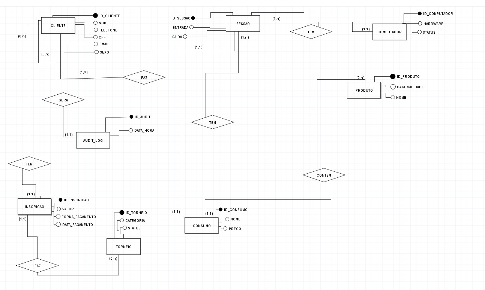
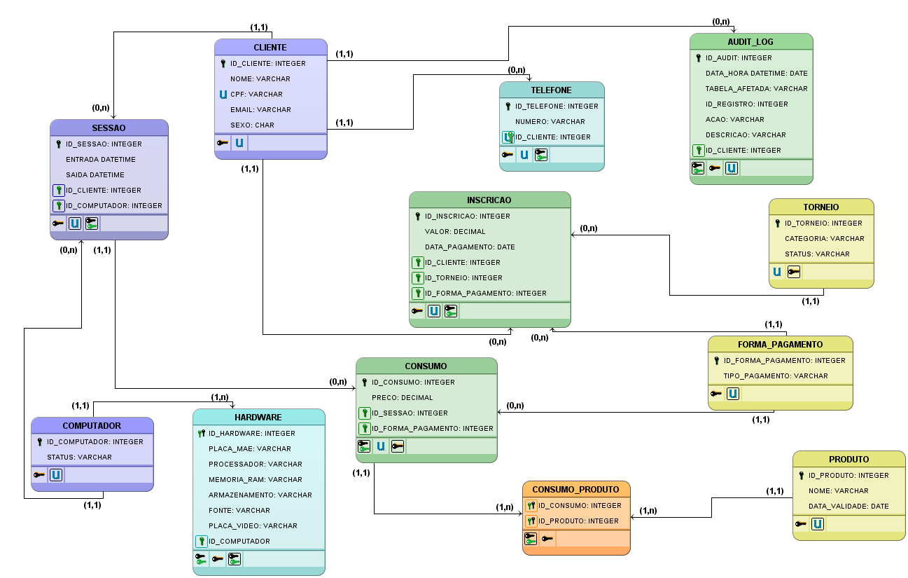

# Projeto_SGLH
Projeto destinado a disciplina de Banco de Dados, onde vamos trabalhar um Sistema de Gerenciamento de uma Lan House.

## TURMA
ADS2N

## AUTORES
- Pedro Caio Francisco da Silva
- João Vitor Santos Silva
- Elton da Silva Soares de Souza

  ---

# Índice

- [Domínio e Contexto do Negócio](#domínio-e-contexto-do-negócio)
- [Descrição das Entidades](#descrição-das-entidades)
- [Modelagem Conceitual (DER)](#modelagem-conceitual-der)
- [Modelagem Lógica](#modelagem-lógica-tabela)
- [Normalização do Banco de Dados](#normalização-do-banco-de-dados)
- [Estrutura Física do Banco de Dados (DDL)](#estrutura-física-do-banco-de-dados-ddl)

---

# Domínio e Contexto do Negócio

O sistema foi projetado para gerenciar as operações diárias de uma Lan House, focando em conveniência, acessibilidade e organização dos serviços oferecidos.

O negócio funciona principalmente através de:

- Venda de horas de uso dos computadores;
- Serviços de impressão;
- Comercialização de produtos;
- Organização de torneios gamers.

O sistema mantém controle sobre:

- Utilização das máquinas;
- Consumo realizado pelos clientes;
- Participação em torneios;
- Registros de auditoria e segurança.

---

# Descrição das Entidades
	
## Cliente
Representa os frequentadores da lan house. É uma entidade central para identificação e histórico.

## Sessão
Registra o uso do tempo em computadores.

## Computador
Representa as máquinas físicas disponíveis no estabelecimento, incluindo configurações de hardware e status:
- Livre
- Ocupado
- Manutenção

## Consumo
Entidade responsável pelo registro do que foi adquirido durante a permanência na lan house.

## Produto
Entidade responsável por itens vendidos no balcão:
- Doces
- Águas
- Refrigerantes
- Folhas de impressão e etc.

## Inscriçao
Entidade que formaliza a participação de um cliente em um torneio específico. Fundamental para organizar as chaves das competições.

## Torneio
Eventos organizados pela Lan House, como:
- Torneio de FIFA
- Counter-Strike 2
- Com premiação determinada pela Lan House.

## Audit_log
Entidade de segurança responsável pelo rastreamento de ações realizadas no sistema, Essencial para o dono da lan house evitar fraudes ou erros de caixa.

# MODELAGEM CONCEITUAL (DER)

---

# MODELAGEM LÓGICA (TABELA)

# Normalização do Banco de Dados

O modelo lógico foi desenvolvido aplicando as três primeiras formas normais, com o objetivo de reduzir redundâncias, evitar inconsistências e melhorar a integridade dos dados.

## 1ª Forma Normal (1FN)

A Primeira Forma Normal foi aplicada garantindo que:

- Todos os atributos possuem valores atômicos;
- Não existem grupos repetitivos;
- Cada coluna possui apenas um valor por registro.

---

## 2ª Forma Normal (2FN)

A Segunda Forma Normal foi aplicada eliminando dependências parciais.

Todas as tabelas:

- Possuem chave primária definida;
- Possuem atributos dependentes totalmente da chave primária.

---

## 3ª Forma Normal (3FN)

A Terceira Forma Normal foi aplicada removendo dependências transitivas.

Dessa forma:

- Nenhum atributo não-chave depende de outro atributo não-chave;
- Os dados foram organizados em entidades independentes.

---

# Estrutura Física do Banco de Dados (DDL)

O script SQL completo responsável pela criação do banco de dados e das tabelas do sistema pode ser encontrado no arquivo abaixo:

[DDL.sql](./database/DDL.sql)

---

# Ferramentas Utilizadas

- MySQL
- MySQL Workbench
- brModelo
- GitHub
- Figma
